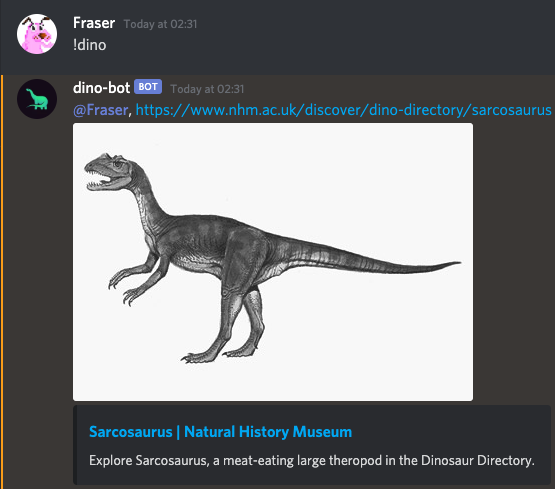

## DinoBot (Discord Bot)
___
#### About
DinoBot is a Discord bot that provides dinosaur profiles and learning resources. Learn some new dinosaur species today! 



- All data is from the Natural History Museum (https://www.nhm.ac.uk)
- Dino avatar created by Vitalii Soroka (https://dribbble.com/Yomisceto)

#### Usage

1. `!dino` is the core command, which returns a random dino profile
2. `!dino help` informs user of possible commands

#### Installation
1. Create Discord App [(like so)](https://github.com/Chikachi/DiscordIntegration/wiki/How-to-get-a-token-and-channel-ID-for-Discord#create-an-application-in-discords-system), store the `bot token` some where for now
1. Clone directory
2. Run `npm install`
3. create a JSON file called `env.json` with **this** structure:
```json
{
  "botToken": "BOT TOKEN HERE",
  "loglevel": "debug"
}
```
4. run `npm run start`
5. Bots alive

To invite to your server use the following URL with **YOUR** client id:
`https://discordapp.com/oauth2/authorize?&client_id=ID&scope=bot&permissions=8`
